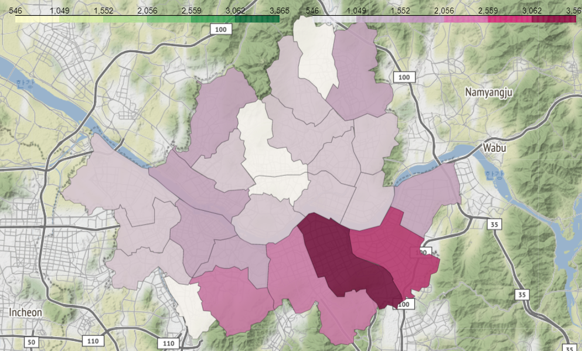

# COVID19 PROJECT

> 주제 : 코로나 바이러스 발생 현황과 예방접종 현황
>
> 조원 : 장은준, 김용주
>
> 프로젝트 시작일 : 2021_08_13

# 코로나 시대, 여행 사업의 현주소는??

***최근 급격히 증가하는 국내 확진자 수와, 시작된 백신 접종.***

***이로 인해서 여행 사업은 어떻게 되었을까?***

(아래 사진은 국내 구별 확진자 수)

# 

# 프로젝트 진행 상황

**2021_08_13**

- 공공데이터 포털에서 분석에 사용한 데이터셋 찾기
- Open API 데이터셋 긁어보기

**2021_08_14**

- 분석방향과 사용가능한 데이터 찾기

##### ***8월 14일 분석방향***

코로나 환자 수 추이 확인(거리두기 단계에 따른 확진자 수 추이 확인),예방접종센터 위치 확인, 그 이외에는 토론 중 더 생각해보기로 함

##### ***사용 데이터***

1. 서울특별시 코로나 사이트에서 최신 코로나 바이러스 데이터 크롤링

2. 서울특별시 코로나 자치구별 확진자 발생동향 사용

3. 공공데이터활용지원센터_코로나19 예방접종센터 현황

내일까지 코로나 바이러스와 엮을 수 있을만한 것과 가능한 데이터 찾아보기

(배달 건수, 유동인구, 등등)

**2021_08_15** 

- 분석방향 설정과 그에 맞는 데이터셋 찾기

  

  ***8월 15일 분석방향***

  1. 코로나 환자 현황 시각화하여 보여주고 이를 통해서 코로나 현황을 진단

  2. 앞선 코로나 현황 상황 진단을 토대로 코로나 이후 여행사업의 추이 살펴보기

  3. 코로나 예방접종센터 위치와 예방접종현황 살펴보기, 예방접종 현황 상태에 따른 코로나 확진자 현황과 여행사업 추이 진단.

  

- 코로나 크롤링 데이터 전처리함.

- 내일부터는 각 csv, xlsx 파일 전처리함.

  

> **최종 분석방향**
>
> - 코로나 환자 현황 시각화하여 보여주고 이를 통해서 코로나 현황을 진단
> - 앞선 코로나 현황 상황 진단을 토대로 코로나 이후 여행사업의 추이 살펴보기
> - 코로나 예방접종센터 위치와 예방접종현황 살펴보기, 예방접종 현황 상태에 따른 코로나 확진자 현황과 여행사업 추이 진단.

**2021_08_17**

- 각자 전처리, 데이터 분석할 csv 파일 선정

- 화면 공유로 각 csv별 시각화를 어떤식으로 할지 결정

- 5시까지 github에 오늘 각자 한거 올리고 같이 리뷰
- 김용주 : 코로나19 여행관련 데이터.xlsx,  서울특별시 코로나19 백신 예방접종 현황.csv

- 장은준 : corona_df_2021_08_14.csv(크롤링),  공공데이터활용지원센터_코로나19 예방접종센터 현황_ 2021071.csv 

***예방접종 현황 csv***

***용주***

1. 첫 번째

   x축 : 접종일

   y축 :  당일 1차접종자 수, 당일 2차 접종자 수

   => 날짜별 접종자 수를 파악해서 어떤 달에 많이 맞는지, 휴일에 많이 맞는지 평일에 많이 받는지 추이 파악

   => 만일 접종자 수 추이 특이점이 보이는 날이 있으면 그 일에 무슨일이 있었는지 추측

2. 두 번째

   접종대상자수를 막대 그래프 그리고, 접종대상자가 갑자기 늘었거나 줄어드는 특이점을 파악한 이후에 그 날짜에 대해서 분석8

3. 세 번째

   1차 접종, 2차 접종 누적 추이 해보기

4. 네 번째

   요일 칼럼을 만들어서 요일별 접종자수 확인하기

   월화수목금토일

   월요일별 접종자수.sum()

***코로나 환자현황 데이터 csv***

***은준*** 

1. 첫 번째

   코로나 확진자가 거주하는 지역  count() 해서 지도에 나타내기

   => 어떤 거주지에 환자가 많은지

2. 두 번째

   여행력에서, 해외여행한 사람들만 df 뽑아서, 대륙별로 type을 구별해서 새로운 칼럼을 생성.

   대륙별 확진자수를 파악.

   확진자수가 가장 많은 대륙을 찾고, 그 대륙에서 가장 많은 확진자수를 가지고 있는 나라를 찾기.

   => 그 나라는 안가면 좋겠다고 공지.

3. 세 번째

   날짜별 환자수 선그래프 그리기

4. 네 번째

   환자가 발생한 위치 파악접촉력에서 '구' 만 빼서 데이터 프레임 만들기.

   그리고 그 데이터 프레임에서 barplot 을 그려서 어떤 구에 확진자 수가 많은지 표시

   어떤 구에서 확진자가 많이 생기는지(지도)

***2021_08_18 ~ 2021_08_23***

- 상대가 해온 code 작업을 리뷰
- 상대 리뷰를 참고하여 본인 ppt 작성

***2021_08_24***

- ppt 각자 완성하고 합치기
- 최종 pdf 파일 올리기
- github 정리

​				

